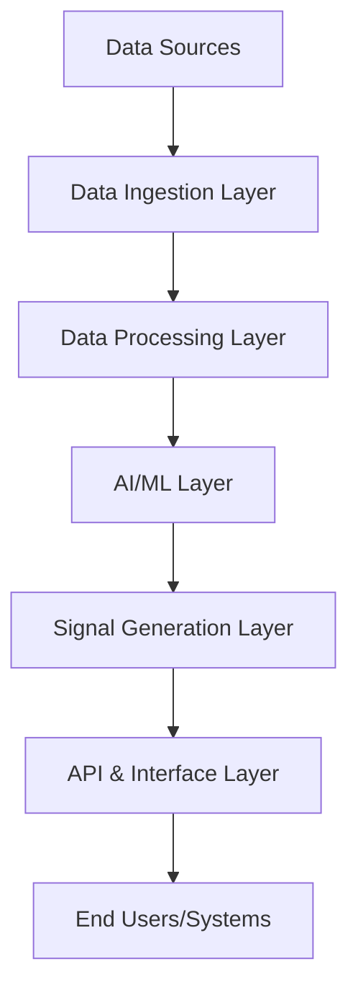

# AI Cryptocurrency Market Intelligence System Design

## 1. System Overview
The AI Cryptocurrency Market Intelligence System is designed to provide advanced trading signals and market insights through the analysis of multiple data sources and sophisticated AI models. The system aims to create measurable economic value by identifying trading opportunities and market trends with higher accuracy than traditional methods.

## 2. System Architecture

### 2.1 Core Components
1. **Data Ingestion Layer**
   - Real-time cryptocurrency price feeds
   - Order book data collectors
   - Social media sentiment analyzers
   - News aggregators
   - On-chain metrics collectors

2. **Data Processing Layer**
   - Data cleaning and normalization
   - Feature engineering pipeline
   - Time series preprocessing
   - Real-time stream processing
   - Historical data warehouse

3. **AI/ML Layer**
   - Market prediction models
   - Sentiment analysis models
   - Anomaly detection systems
   - Pattern recognition algorithms
   - Portfolio optimization models

4. **Signal Generation Layer**
   - Trading signal generators
   - Risk assessment modules
   - Position sizing calculator
   - Market regime classifier
   - Alert system

5. **API & Interface Layer**
   - RESTful API endpoints
   - WebSocket real-time feeds
   - User dashboard
   - Reporting system
   - Notification service

### 2.2 Data Flow

## 3. Key Functionalities

### 3.1 Data Collection & Processing
- Real-time market data ingestion from multiple exchanges
- Social media sentiment analysis (Twitter, Reddit, etc.)
- News sentiment analysis and impact assessment
- On-chain metrics analysis (transaction volume, wallet activity, etc.)
- Technical indicator calculation and storage

### 3.2 AI/ML Capabilities
- Price movement prediction (short-term and long-term)
- Market regime classification
- Volatility forecasting
- Sentiment analysis and impact prediction
- Pattern recognition for technical analysis
- Anomaly detection for market manipulation

### 3.3 Signal Generation
- Entry/exit point identification
- Risk-adjusted position sizing recommendations
- Portfolio rebalancing signals
- Risk management alerts
- Market opportunity scoring

### 3.4 User Interface & Reporting
- Real-time dashboard with key metrics
- Customizable alert system
- Performance analytics and reporting
- API access for automated trading systems
- Historical analysis tools

## 4. Technical Stack

### 4.1 Infrastructure
- Cloud Platform: AWS/GCP
- Container Orchestration: Kubernetes
- Message Queue: Apache Kafka
- Database: 
  - Time-series DB: InfluxDB
  - Document Store: MongoDB
  - Cache: Redis

### 4.2 Technologies
- Data Processing: Apache Spark, Python
- ML Framework: PyTorch, TensorFlow
- API: FastAPI
- Real-time Processing: Apache Flink
- Frontend: React with TypeScript

## 5. Security Considerations
- End-to-end encryption for data transmission
- API authentication and rate limiting
- Regular security audits
- Secure key management
- Data privacy compliance

## 6. Scalability & Performance
- Horizontal scaling capabilities
- Load balancing
- Caching strategies
- Database sharding
- Performance monitoring and optimization

## 7. Future Enhancements
- Integration with additional data sources
- Advanced AI model development
- Enhanced automation capabilities
- Mobile application development
- Cross-asset correlation analysis

## 8. Success Metrics
- Prediction accuracy rates
- Signal profitability
- System latency and uptime
- User engagement metrics
- Portfolio performance improvement 